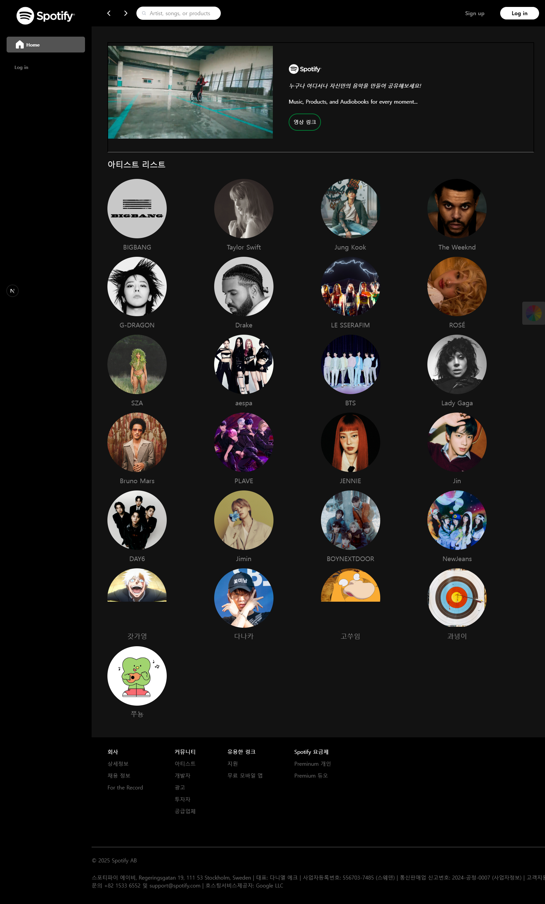
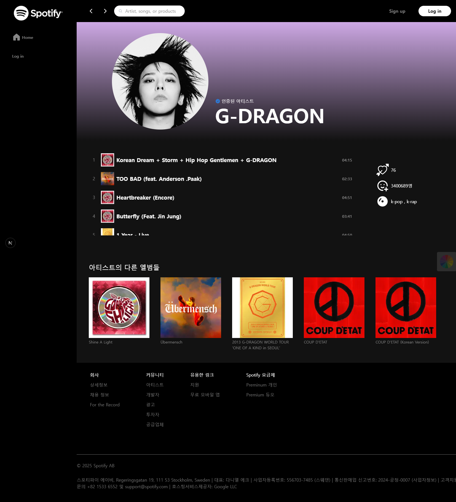
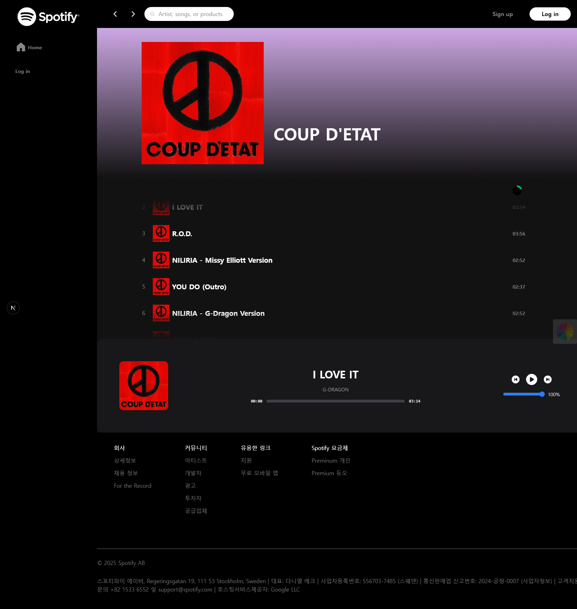
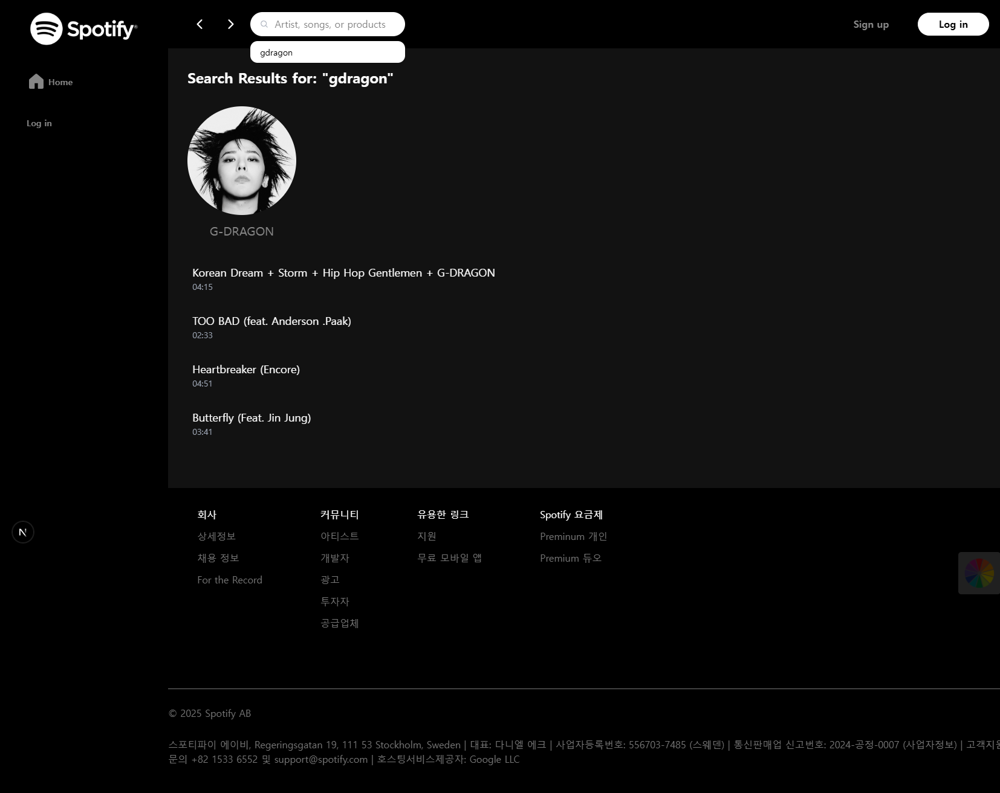
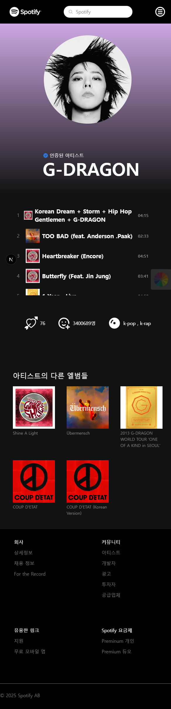
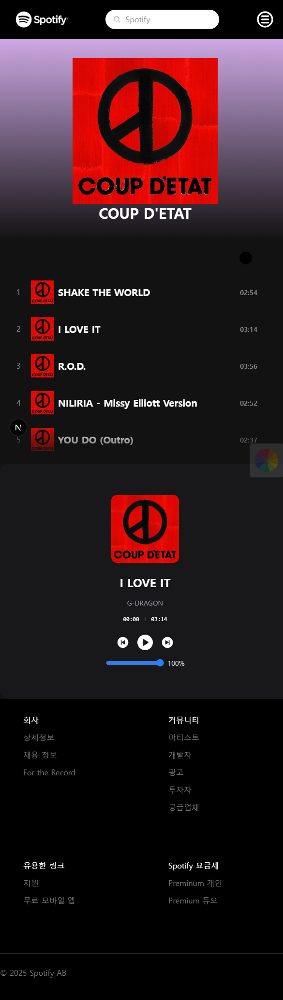

<!-- logo -->

 

# Spotify 프로젝트 🖍️

 

## 📝 프로젝트 개요

next.js와 typescript 언어를 배운 후 적용하고 싶어서 Spotify 사이트 클론코딩을 하게 되었습니다.

다음과 같은 내용을 작성할 수 있습니다.

- 프로젝트 개요
- 프로젝트 화면 구성
- 사용한 기술 스택
- 기술적 이슈와 해결 과정
- 프로젝트 팀원

필요한 기술 스택에 대한 logo는 [skills 폴더](/skills/)에서 다운로드 받을 수 있습니다.

 

## 화면 구성

|                         메인 화면                         |
| :-------------------------------------------------------: |
|             |
| 스포티파이 영상과 함께 아티스트들 모음집을 볼 수 있습니다 |

|                                                                   상세 화면                                                                   |
| :-------------------------------------------------------------------------------------------------------------------------------------------: |
|                                                                                               |
|                                                                                                |
|                                                                                               |
|                                                                                                |
|                                                                                             |
|                                                                                              |
| 메인 페이지에서 아티스트를 선택하면 볼 수 있는 화면 입니다.   아티스트의 앨범들을 볼 수 있고 앨범을 클릭하면 앨범에 관한 트랙이 나옵니다. |

 

## ⚙ 기술 스택

### Front-end

### Tools

 

## 🤔 기술적 이슈와 해결 과정

- Framer Motion 디자인 및 반응형 구현 과정
  - 공식 홈페이지 참고 후 하나하나 적용해가면서 변경된 디자인 확인 (https://motion.dev/)
- TypeScript Type 관리 및 Params 받아오는 과정
  - 최대한 공통된 Type들은 하나의 타입으로 구성하여 여러곳에서 사용할 수 있도록 함
- Navigation Bar 검색 기능 구현
  - 수업 시 Todo 페이지 구현시 localStorage 사용했던 것을 참고하여 문제 해결
- FireBase, Component 세분화
  - 여러 참고 자료 및 구글링을 바탕으로 해결 / 기능별 / 타입별로 분류

 

## 💁‍♂️ 프로젝트 팀원

|               Frontend               |               Frontend                |
| :----------------------------------: | :-----------------------------------: |
|                                      |                                       |
| [박준용](https://github.com/Ori0li)  |  [이광녕](https://github.com/GN-Lee)  |
|                                      |                                       |
|               Frontend               |               Frontend                |
|                                      |                                       |
| [김수임](https://github.com/KImSuim) | [유가영](https://github.com/asom0160) |
